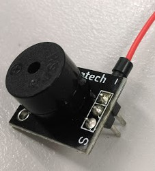
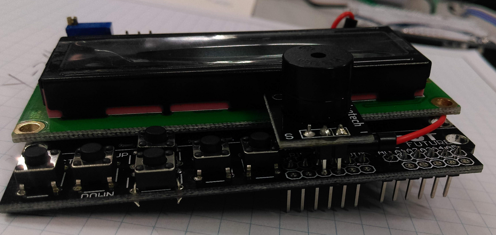
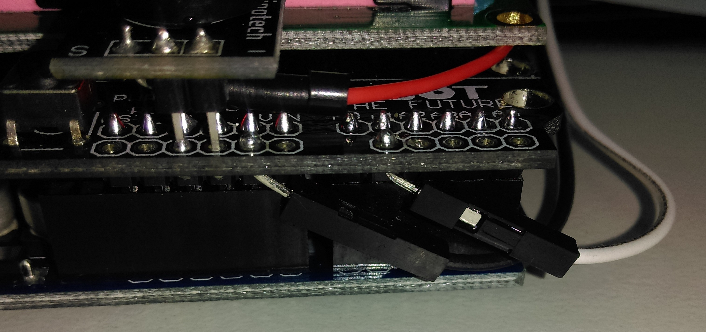
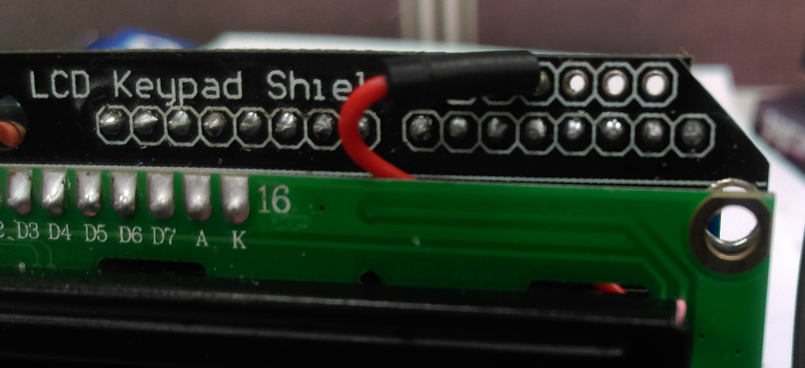
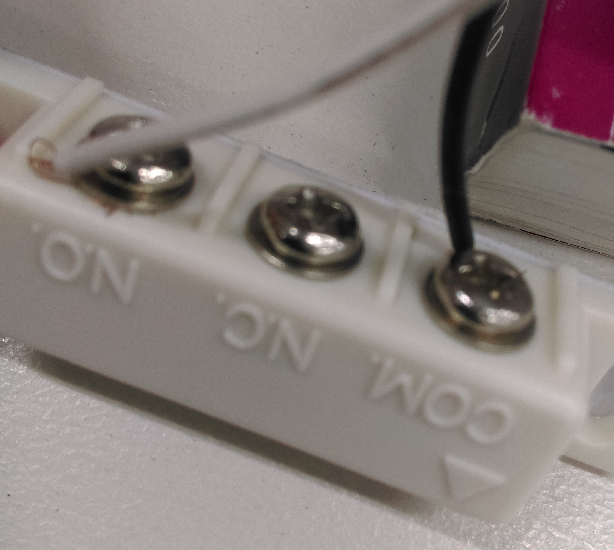

# Arduino Fridge Alarm

This neat little project is a good way to learn about simple Arduino programming. The unit is connected to a door latch, which will set an alarm after a configurable amount of time. It also uses the LCD controller shield to set and configure the time delay between door open and the alarm sounding.

## Bill of Materials

|Qty| Code | Description |
|---|---|---|
|1 | [XC4454](http://jaycar.com.au/p/XC4454) | LCD controller
|1 | [XC4410](http://jaycar.com.au/p/XC4410) | UNO main board
|1 | [XC4424](http://jaycar.com.au/p/XC4424) | Buzzer module
|1 | [LA5072](http://jaycar.com.au/p/LA5072) | Reed switch
|1 | [HM3211](http://jaycar.com.au/p/HM3211) | 28 pin header strip

Some wires to connect the reed switch to the arduino

## Connection Table

The primary connections will be made on the LCD shield, which will then just fit on top of the Arduino.

|LCD shield |Buzzer |Latch
|--- |--- |---
|Ground |Ground (-) |Common (COM)
|D3 |S||
|A1||N.O.

Simple, eh?

## Assembly.

Assembly of this unit is fairly straight forward. Firstly we can mount the buzzer by unsoldering the  header that comes with it and putting our own two pin header, and a short wire from the S pin going under and around, like such.

Then solder the unit on top of the LCD shield, with the (-) pin in one of the ground connections, and the middle pin in 5v, as shown in the picture below.

While we're here, we'll also hook up the reed switch, which are simply two wires from A1 and Ground:

With the wire, loop it up around under the green LCD board up to the 4th hole on the top row of the board, this corresponds to pin 3.

Connect the other wires to the reed switch as normal. There's no need to concern with which one is COM and which one is N.O. - if your switch has 3 terminals, then you also have a N.C (normally closed), which will do the opposite of what you'd expect. (alarm/countdown on closed!)

## Programming

This code uses standard libraries, so there’s no need to install anything else out of the box.

Download and run the code file, and upload it to your Arduino board. You should see it output and display FRIDGE ALARM: CLOSED/OPEN and start making a noise after 5 seconds of being open.

Look through the code and see how the code is working to get an understanding of it. There’s information in the serial monitor aswel which can help if you get stuck.

## Use

Once the alarm is attached to a fridge or door, the user has 5 seconds (default) to open and close the door before the alarm will sound. Pressing any button on the controller brings up the menu where you can set the length of time before the alarm sounds (in milliseconds) – up down is a tenth of a second, and left right is whole seconds.

Once time is configured, "select" will save it and return into alarm mode. Leaving the latch open for too long sounds the alarm.

If the alarm is sounding, simply close the latch or press any button on the controller will deactivate the alarm.

## Future improvements:

* You can add a status LED module (such as [XC4428](https://jaycar.com.au/p/XC4428) ) to display different states, ie: `ARMED`, `TRIPPED`, `ALARM`, `TRIGGERED`.

* The buzzer is annoying to everyone in the household except you, so you could try and use a speaker instead ( [AS3006](https://jaycar.com.au/p/AS3006) or similar) to play a nice melody instead. This requires “PWM” output, so look at the “tone” example for some inspiration.

* Use a temperature sensor ( [XC3700](https://jaycar.com.au/p/XC3700) ) to show the temperature of the fridge along with the latch alarm.
